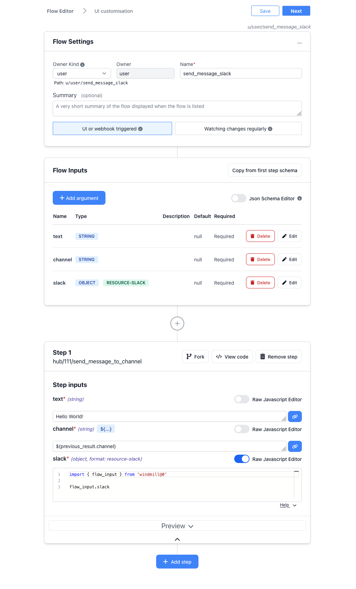

<p align="center">
  <a href="https://app.windmill.dev"></a>
</p>
<p align="center">
    <em>.</em>
</p>
<p align=center>
Open-source and self-hostable alternative to Airplane, Pipedream and a simplified Temporal with autogenerated UIs to trigger flows and scripts as internal apps. Convert code to no-code modules and, if the auto-generated UI is not sufficient, use it solely as an highly scalable backend layer. Add automation to your product or build your own no-code tool and delegate the core layer to Windmill
.
</p>
<p align="center">
<a href="https://github.com/windmill-labs/windmill/actions/workflows/docker-image.yml" target="_blank">
    
</a>
<a href="https://pypi.org/project/wmill" target="_blank">
    
</a>
<a href="https://discord.gg/V7PM2YHsPB" target="_blank">
  
</a>
</p>

---

**Join the beta (personal workspaces are free forever)**:
<https://app.windmill.dev>

**Documentation**: <https://docs.windmill.dev>

**Discord**: <https://discord.gg/V7PM2YHsPB>

**Hub**: <https://hub.windmill.dev>

**Contributor's guide**: <https://docs.windmill.dev/docs/contributors_guide>

**Roadmap**: <https://github.com/orgs/windmill-labs/projects/2>

You can show your support for the project by starring this repo.

---

Windmill Labs offers commercial licenses and support to convert your existing
automations and help you scale it in production. If interested, contact
ruben@windmill.dev (founder of Windmill).

---

# Windmill

<p align="center">
<b>Disclaimer: </b>Windmill is in <b>BETA</b>. It is secure to run in production but we are still <a href="https://github.com/orgs/windmill-labs/projects/2">improving the product fast<a/>.
</p>


Windmill is <b>fully open-sourced</b>:

- `community/`, `python-client/` and `deno-client/` are Apache 2.0
- backend, frontend and everything else under AGPLv3.

## What is the general idea behind Windmill

1. Define a minimal and generic script in Python or Typescript that solve a
   specific task. Here sending an email with SMTP. The code can be defined in
   the provided Web IDE or synchronized with your own github repo:
   

2. Your scripts parameters are automatically parsed and generate a frontend. You
   can narrow down the types during task definition to specify regex for string,
   an enum or a specific format for objects. Each script correspond to an app by
   itself: 

3. Make it flow! You can chain your scripts or scripts made by the community
   shared on [WindmillHub](https://hub.windmill.dev). There is tight integration
   between Windmill and the hub to make it easy to build flows from a soon-to-be
   exhaustive library of generic modules. In flows, one can pipe output to input
   using "Dynamic" expressions that are just plain Javascript underneath. Flows
   can contain for-loops, branching (coming soon). As such and coupled with
   inputs being able to refer to any step's output, they are actual DAG rather
   than just linear sequences. They are backed by an open JSON spec we call
   [OpenFlow](https://docs.windmill.dev/docs/openflow)
   

Both scripts and flows are not restricted to be triggered by the UI. They can be
triggered by a schedule, watch for changes (using
[internal states](https://docs.windmill.dev/docs/reference#internal-state)) or
triggered through API with either an async or sync webhook. The latter kind of
endpoints make Windmill akin to a self-hostable AWS Lambda. Windmill can be the
central place to host, build and run all of your integrations, automations and
internal apps. We include credentials management and OAuth integration, groups
and much more!

## Layout

- `backend/`: The whole Rust backend
- `frontend`: The whole Svelte frontend
- `community/`: Scripts and resource types included in every workspace. It is
  useful for Python scripts since the [WindmillHub](https://hub.windmill.dev)
  only allow deno scripts and for sharing resource types that will be included
  in every workspace.
- `lsp/`: The lsp asssistant for the monaco editor
- `nsjail/`: The nsjail configuration files for sandboxing of the scripts'
  execution
- `python-client/`: The wmill python client used within scripts to interact with
  the windmill platform
- `deno-client/`: The wmill deno client used within scripts to interact with the
  windmill platform

## Stack

- Postgres as the database
- backend in Rust with the following highly-available and horizontally scalable
  architecture:
  - stateless API backend
  - workers that pull jobs from a queue in Postgres (and later, Kafka or Redis.
    Upvote [#173](#https://github.com/windmill-labs/windmill/issues/173) if
    interested )
- frontend in Svelte
- scripts executions are sandboxed using google's
  [nsjail](https://github.com/google/nsjail)
- javascript runtime is the
  [deno_core rust library](https://denolib.gitbook.io/guide/) (which itself uses
  the [rusty_v8](https://github.com/denoland/rusty_v8) and hence V8 underneath)
- typescript runtime is deno
- python runtime is python3

## Sandboxing and workload isolation

Windmill uses nsjail on top of the deno sandboxing. It is pretty secure. Do not
take our word for it, take
[fly.io's one](https://fly.io/blog/sandboxing-and-workload-isolation/)

## Performance

The performances are great, as long as you do not exceed the parrallelism of the
workers, we are
[worse than AWS Lambda for small workloads but not by that much](https://docs.windmill.dev/docs/benchmark)

## Architecture

<p align="center">


</p>

## How to self-host

`docker compose up` with the following docker-compose is sufficient:
<https://github.com/windmill-labs/windmill/blob/main/docker-compose.yml>

For older kernels < 4.18, set `DISABLE_NUSER=true` as env variable, otherwise
nsjail will not be able to launch the isolated scripts.

To disable nsjail altogether, set `DISABLE_NSJAIL=true`.

The default super-admin user is: admin@windmill.dev / changeme

From there, you can create other users (do not forget to change the password!)

Detailed instructions for more complex deployments will come soon. For simpler
docker based ones, the docker-compose.yml file contains all the necessary
informations.

### OAuth for self-hosting

To get the same oauth integrations as Windmill Cloud, mount `oauth.json` with
the following format:

```json
{
  "<client>":
    "id": "<CLIENT_ID>",
    "secret": "<CLIENT_SECRET>"
}
```

and mount it at `/src/usr/app/oauth.json`.

You will also want to import all the approved resource types from
[WindmillHub](https://hub.windmill.dev).

## Contributors

<a href="https://github.com/windmill-labs/windmill/graphs/contributors">
  
</a>

## Copyright

Windmill Labs, Inc 2022
